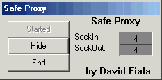



## Safe Proxy

### Description

IMPORTANT: Before you open the code rename systray.oc_x to systray.ocx

Safe proxy acts like a normal HTTP proxy but you can customize it to block out content. It is currently programmed to block out file uploads.
 
### More Info
 
For inputs all you need to do is setup your webbrowser and it does the inputs for you! :)

Internet explorer users: Tools menu -> Internet Options -> Connections Tab -> LAN Settings button -> Check Use Proxy Server -> Put in servers IP(whatever computer is running it) and the port: 8180

Press OK a couple times and your set :)

To undo go back to LAN settings and uncheck 'Use Proxy Server'

To do this, its much easier with 2 computers networked together. The one with internet access should run the proxy server.

It returns the page right back to the web browser :)

There is 1 sideeffect mainly but its not a big problem. As all proxy servers do, it will make the connection slower for the user requesting the page.

             |
---                |---
**Submitted On**   |2001-05-29 09:35:30
**By**             |[Close\_Account](https://github.com/Planet-Source-Code/PSCIndex/blob/master/ByAuthor/close-account.md)
**Level**          |Advanced
**User Rating**    |5.0 (25 globes from 5 users)
**Compatibility**  |VB 3\.0, VB 4\.0 \(16\-bit\), VB 4\.0 \(32\-bit\), VB 5\.0, VB 6\.0
**Category**       |[Complete Applications](https://github.com/Planet-Source-Code/PSCIndex/blob/master/ByCategory/complete-applications__1-27.md)
**World**          |[Visual Basic](https://github.com/Planet-Source-Code/PSCIndex/blob/master/ByWorld/visual-basic.md)
**Archive File**   |[Safe Proxy201595282001\.zip](https://github.com/Planet-Source-Code/close-account-safe-proxy__1-23521/archive/master.zip)

